# Motion Planning Transformers (MPT) 全局架构分析与学习指南

## 项目概览

### 项目定位
- **核心功能**：基于Transformer架构的运动规划算法，用于机器人路径规划
- **技术领域**：机器人学、深度学习、运动规划
- **应用场景**：点机器人和Dubins汽车模型的路径规划，适用于迷宫和随机森林环境
- **技术栈**：PyTorch、OMPL、CUDA、Docker

### 系统架构概览

#### 整体架构图
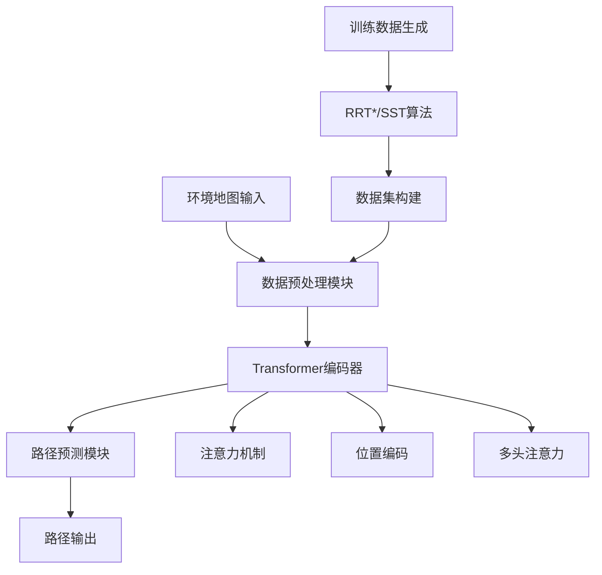

#### 技术栈层次图
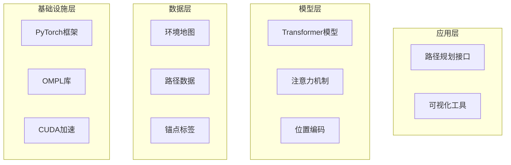

## 核心模块分析

### 模块关系图
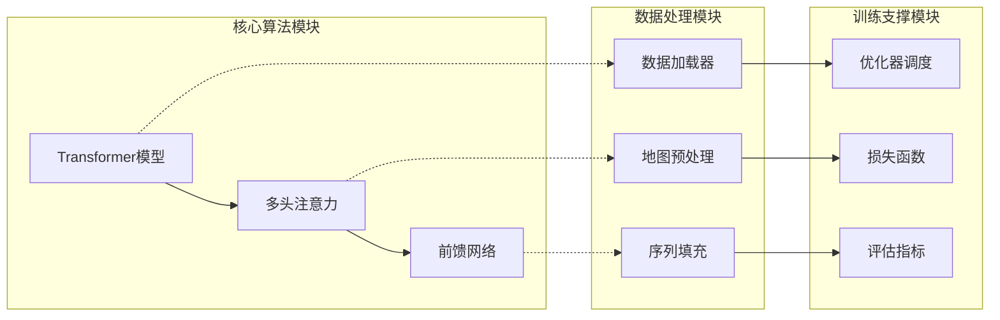

### 模块详细分析表

| 模块名称 | 文件路径 | 核心职责 | 输入接口 | 输出产物 | 依赖关系 | 重要程度 |
|---------|----------|----------|----------|----------|----------|----------|
| Transformer模型 | transformer/Models.py | 核心路径预测算法 | 环境地图张量 | 路径概率分布 | 注意力层、位置编码 | ⭐⭐⭐⭐⭐ |
| 数据加载器 | dataLoader.py | 训练数据管理 | 数据文件路径 | 批量训练数据 | 序列填充、地图处理 | ⭐⭐⭐⭐⭐ |
| 训练脚本 | train.py | 模型训练流程 | 配置参数 | 训练好的模型 | 优化器、损失函数 | ⭐⭐⭐⭐⭐ |
| 评估模块 | eval_model.py | 模型性能评估 | 验证数据 | 准确率指标 | 预训练模型 | ⭐⭐⭐⭐ |
| 数据生成 | rrt_star_map.py | 训练数据生成 | 环境配置 | 路径数据集 | OMPL库 | ⭐⭐⭐ |
| 工具函数 | utils.py | 辅助功能 | 各种数据类型 | 处理结果 | 基础库 | ⭐⭐ |

### 模块分层架构
```
📱 用户交互层
├── 🎯 训练接口 (train.py)
└── 🎯 评估接口 (eval_model.py)

🧠 核心业务层  
├── ⚙️ Transformer模型 (必须精通)
├── ⚙️ 注意力机制 (必须精通)
└── ⚙️ 数据加载器 (重点理解)

🔧 工具支撑层
├── 🛠️ 优化器调度 (会使用即可)
├── 🛠️ 损失函数 (理解原理)
└── 🛠️ 评估指标 (可以跳过)

💾 基础设施层
├── 📁 数据存储模块
├── ⚙️ 配置管理模块
└── 📝 日志记录模块
```

## 数据流与控制流分析

### 主要数据流路径图
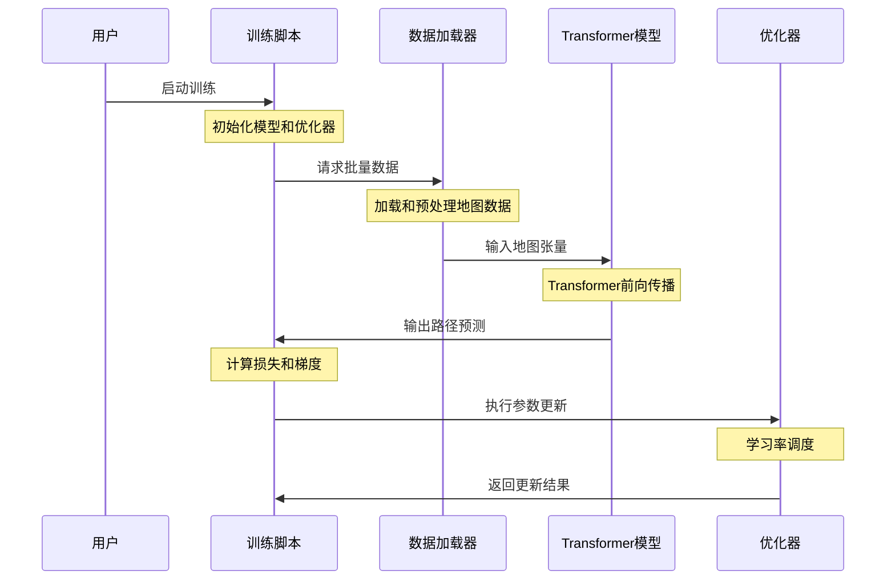

### 关键数据结构流转
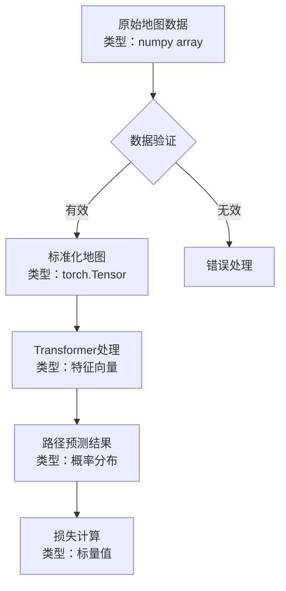

### 配置与参数传递链

| 传递层级 | 配置来源 | 参数类型 | 传递方式 | 影响范围 |
|---------|----------|----------|----------|----------|
| 全局配置 | 命令行参数 | 训练超参数 | argparse | 整个训练流程 |
| 模型配置 | model_args字典 | 网络结构参数 | 构造函数 | Transformer模型 |
| 运行时配置 | 批量数据 | 动态输入 | 函数参数 | 单次前向传播 |

## 模块依赖关系

### 依赖层次结构图
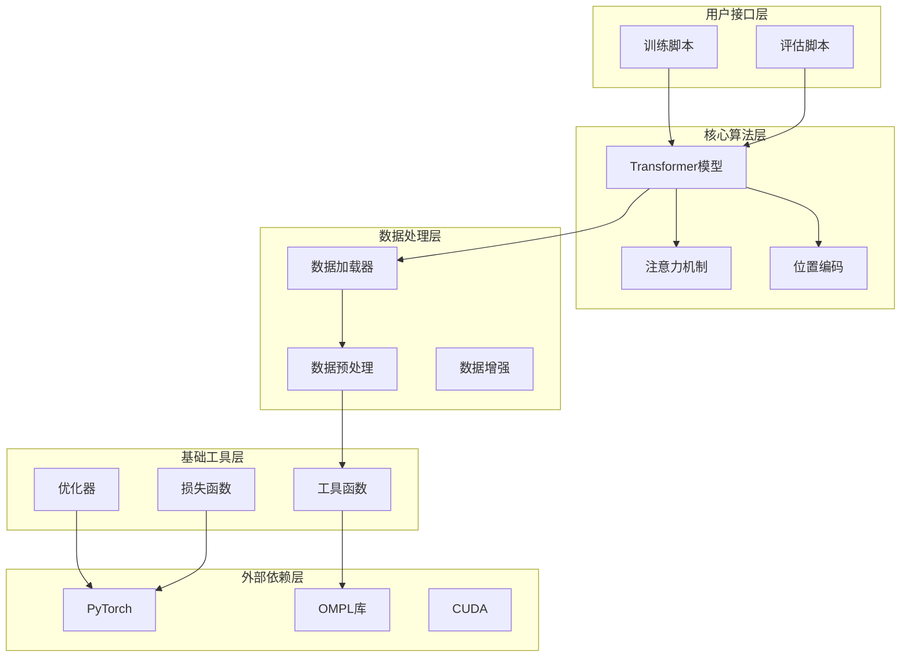

### 依赖强度分析
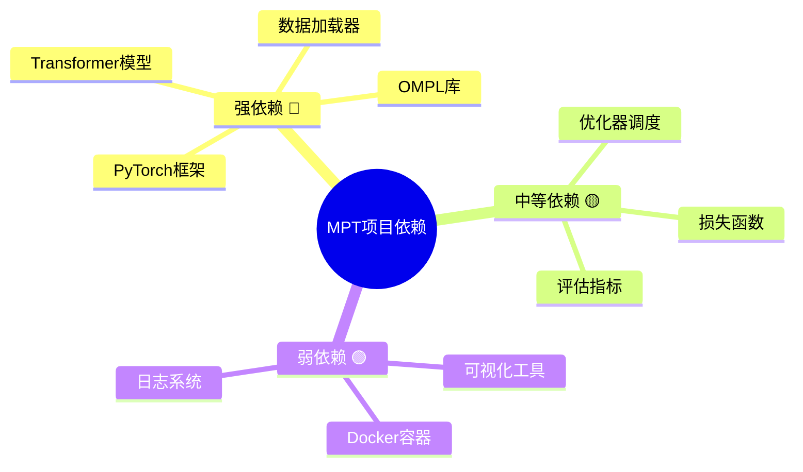

---

# Motion Planning Transformers (MPT) 新手学习指南

## 学习前准备

### 技能树图表
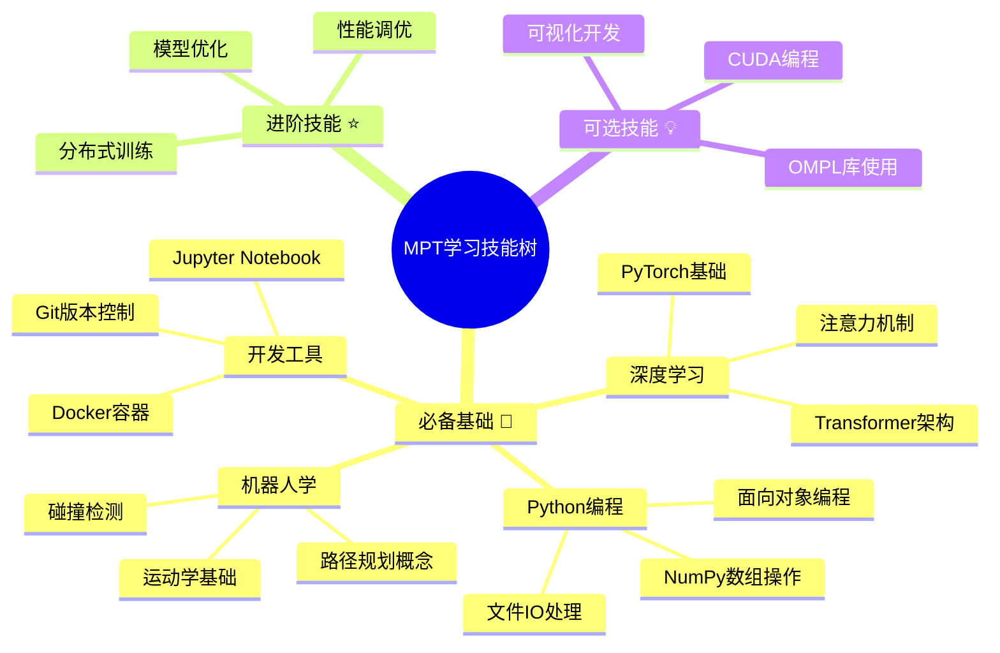

### 前置知识检查清单
- [ ] **Python基础** (必需) - 类、函数、模块、异常处理
- [ ] **PyTorch基础** (必需) - 张量操作、自动微分、模型定义
- [ ] **Transformer理论** (必需) - 注意力机制、位置编码、多头注意力
- [ ] **路径规划概念** (必需) - RRT算法、碰撞检测、运动约束
- [ ] **Linux环境** (推荐) - 命令行操作、环境配置
- [ ] **OMPL库** (可选) - 对理解数据生成有帮助但非必需

## 阶段化学习路径

### 学习进度甘特图

<div style="width: 100%; overflow-x: auto; margin-bottom: 20px;">

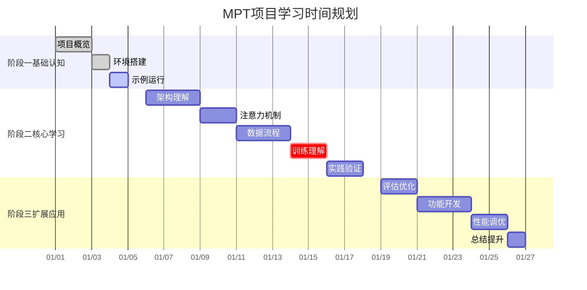

</div>

#### 移动端简化版甘特图
<div style="display: block;">

| 学习阶段 | 任务内容 | 预计时间 | 状态 |
|---------|----------|----------|------|
| **阶段一** | 项目概览理解 | 第1-2天 | ✅ 已完成 |
| | 环境搭建配置 | 第3天 | ✅ 已完成 |
| | 示例代码运行 | 第4天 | 🔄 进行中 |
| **阶段二** | Transformer架构 | 第6-8天 | ⏳ 待开始 |
| | 注意力机制掌握 | 第9-10天 | ⏳ 待开始 |
| | 数据加载流程 | 第11-13天 | ⏳ 待开始 |
| | 训练循环理解 | 第14-15天 | 🔥 关键任务 |
| | 实践验证测试 | 第16-17天 | ⏳ 待开始 |
| **阶段三** | 模型评估优化 | 第19-20天 | ⏳ 待开始 |
| | 功能扩展开发 | 第21-23天 | ⏳ 待开始 |
| | 性能调优实验 | 第24-25天 | ⏳ 待开始 |
| | 项目总结提升 | 第26天 | ⏳ 待开始 |

</div>

### 第一阶段：项目整体认知（1-2天）

#### 学习目标检查表
- [ ] 🎯 能够用一句话描述MPT的核心功能
- [ ] 📊 理解Transformer在路径规划中的应用
- [ ] 🔄 掌握项目的主要数据流
- [ ] ⚙️ 成功运行训练示例

#### 学习路线图
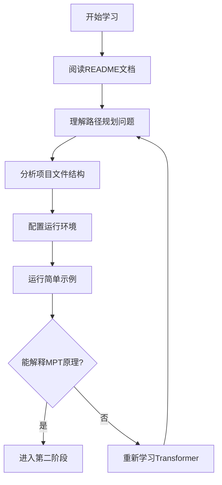

### 第二阶段：核心模块深入（7-10天）

#### 核心模块优先级矩阵

| 模块名称 | 理解难度 | 重要程度 | 学习优先级 | 建议学习时间 |
|---------|----------|----------|------------|-------------|
| Transformer模型 | 🔴 困难 | 🔴 极高 | 1️⃣ 最高 | 4天 |
| 数据加载器 | 🟡 中等 | 🔴 极高 | 2️⃣ 高 | 3天 |
| 训练流程 | 🟡 中等 | 🔴 极高 | 3️⃣ 高 | 3天 |
| 评估模块 | 🟢 简单 | 🟡 中等 | 4️⃣ 中 | 2天 |

#### 学习检查点
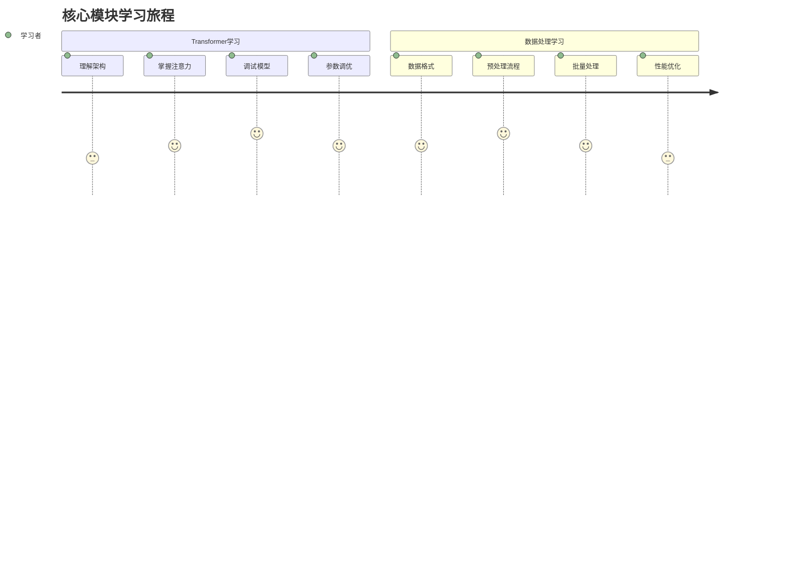

### 第三阶段：扩展应用（5-7天）

#### 实践项目进阶路径
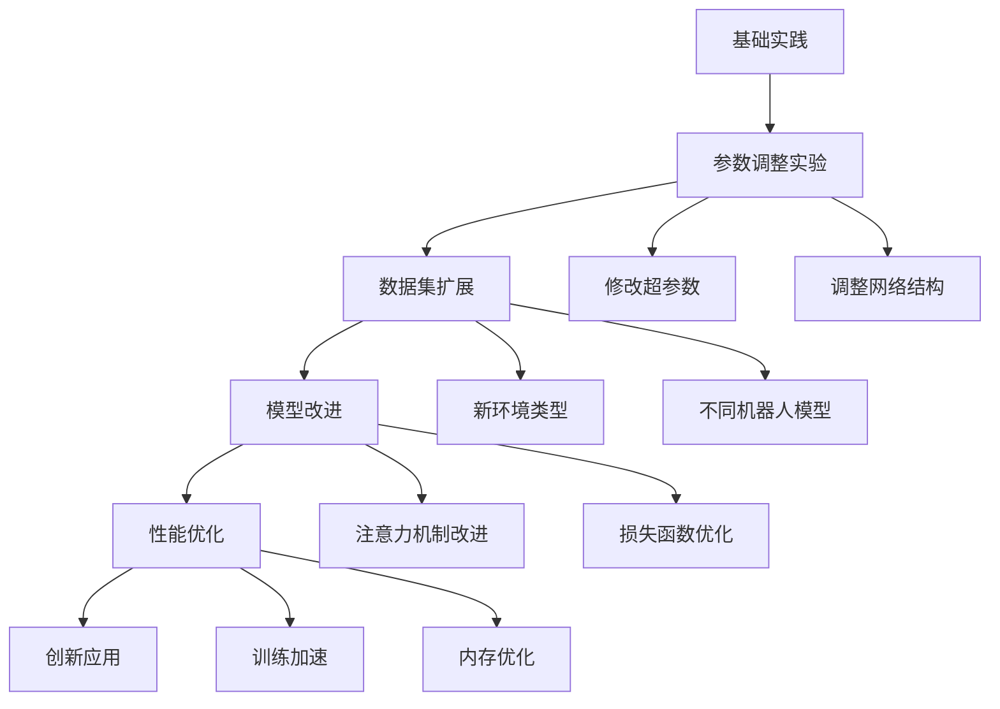

## 核心代码掌握清单

### 必须精通的代码（根基部分）⭐⭐⭐⭐⭐

#### 掌握程度分级图
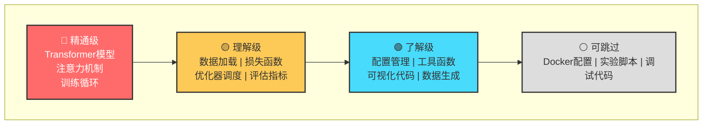

### 学习重点清单

| 代码模块 | 文件位置 | 掌握程度 | 学习重点 | 复习频率 | 实践建议 |
|---------|----------|----------|----------|----------|----------|
| Transformer类 | transformer/Models.py:20-80 | 🔴 精通 | 架构设计+前向传播 | 3遍以上 | 尝试重写实现 |
| MultiHeadAttention | transformer/SubLayers.py:15-45 | 🔴 精通 | 注意力计算+维度变换 | 3遍以上 | 添加可视化 |
| PathDataLoader | dataLoader.py:25-120 | 🔴 精通 | 数据预处理+批量生成 | 3遍以上 | 支持新数据格式 |
| train_epoch函数 | train.py:85-115 | 🟡 理解 | 训练循环+梯度更新 | 2遍 | 添加新的损失函数 |
| cal_performance | train.py:45-65 | 🟡 理解 | 性能计算+损失聚合 | 2遍 | 实现新评估指标 |
| ScheduledOptim | transformer/Optim.py:10-40 | 🟢 了解 | 学习率调度 | 1遍 | 尝试不同调度策略 |

### 学习进度追踪表

#### 第一轮学习记录
- [ ] **Transformer模型** - 开始日期：__ 完成日期：__ 理解程度：__%
- [ ] **数据加载器** - 开始日期：__ 完成日期：__ 理解程度：__%
- [ ] **训练流程** - 开始日期：__ 完成日期：__ 理解程度：__%

#### 复习记录
- [ ] **第一次复习** - 日期：__ 发现问题：____
- [ ] **第二次复习** - 日期：__ 改进理解：____
- [ ] **第三次复习** - 日期：__ 掌握程度：____

---

# 学习效率提升策略

## 代码阅读技巧

### 阅读策略流程图
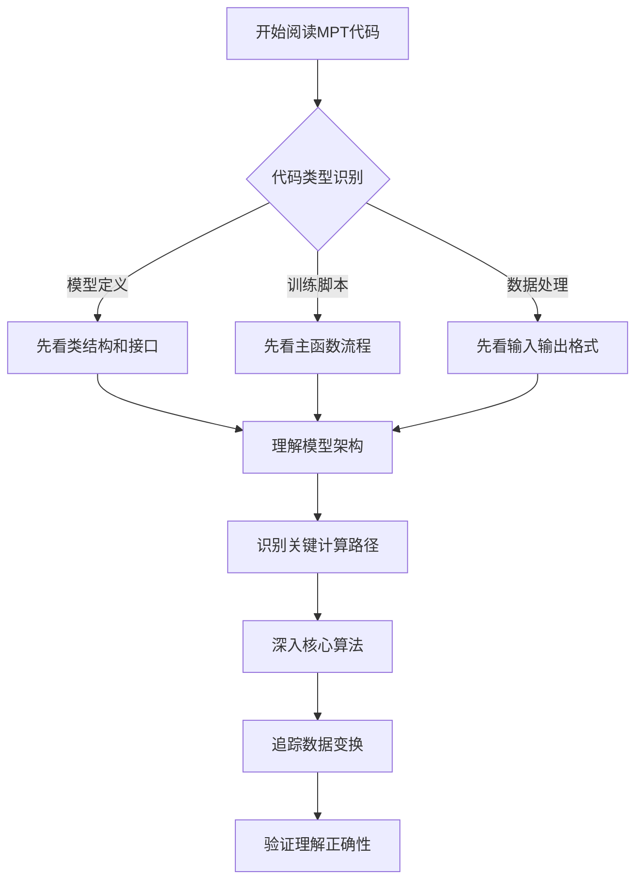

### 学习方法对比表

| 学习方法 | 适用场景 | 优点 | 缺点 | 推荐度 |
|---------|----------|------|------|--------|
| 自顶向下 | 架构理解 | 全局视野清晰 | 可能忽略实现细节 | ⭐⭐⭐⭐⭐ |
| 关键路径优先 | 功能理解 | 学习效率高 | 可能理解不够全面 | ⭐⭐⭐⭐ |
| 实例追踪 | 算法理解 | 具体直观易懂 | 可能过于局限 | ⭐⭐⭐⭐ |
| 对比学习 | 设计理解 | 加深概念理解 | 需要额外背景知识 | ⭐⭐⭐ |

### 实践验证方法

#### 验证方法选择指南
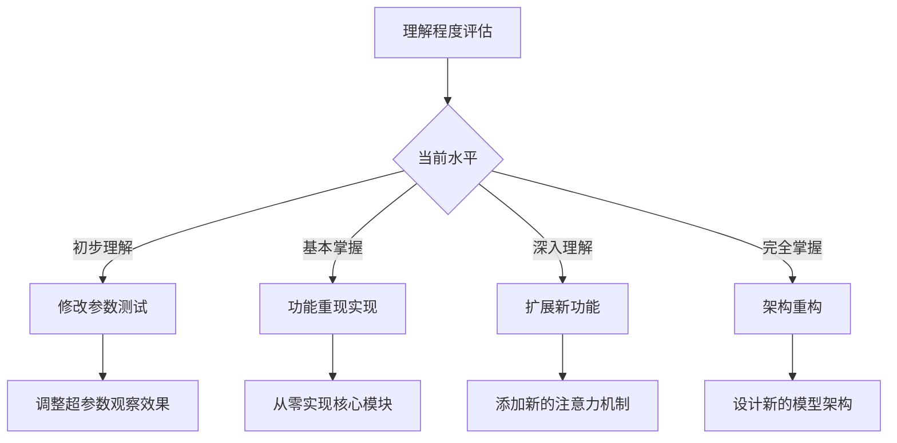

#### 实践项目进阶路径

**Level 1 - 参数调整** 🟢
- 修改模型超参数（层数、头数、维度）
- 更换不同的优化器和学习率
- 调整批量大小和训练轮数

**Level 2 - 功能修改** 🟡
- 添加新的损失函数
- 实现不同的评估指标
- 增加训练过程可视化

**Level 3 - 模块扩展** 🟠
- 实现新的注意力机制变种
- 添加对新环境类型的支持
- 优化数据加载和预处理流程

**Level 4 - 架构改进** 🔴
- 设计新的网络架构
- 实现多任务学习框架
- 集成到实际机器人系统

## 学习进度管理

### 学习里程碑设置
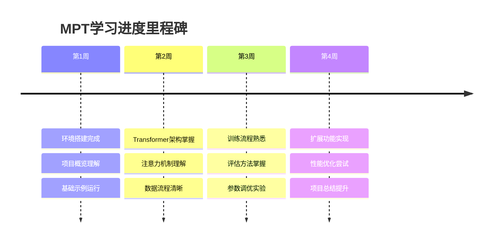

### 学习评估框架

| 评估维度 | 初级(1-3分) | 中级(4-6分) | 高级(7-9分) | 专家级(10分) |
|---------|-------------|-------------|-------------|-------------|
| 理论理解 | 知道MPT是什么 | 理解Transformer原理 | 能够解释设计思想 | 能够创新改进 |
| 实践能力 | 能够运行代码 | 能够修改参数 | 能够扩展功能 | 能够重构架构 |
| 问题解决 | 遇到错误就卡住 | 能够调试简单问题 | 能够优化性能 | 能够预防问题 |
| 知识迁移 | 只会照搬代码 | 能够改编到新场景 | 能够创新应用 | 能够指导他人 |

---

# 学习陷阱识别与规避

## 常见陷阱识别图
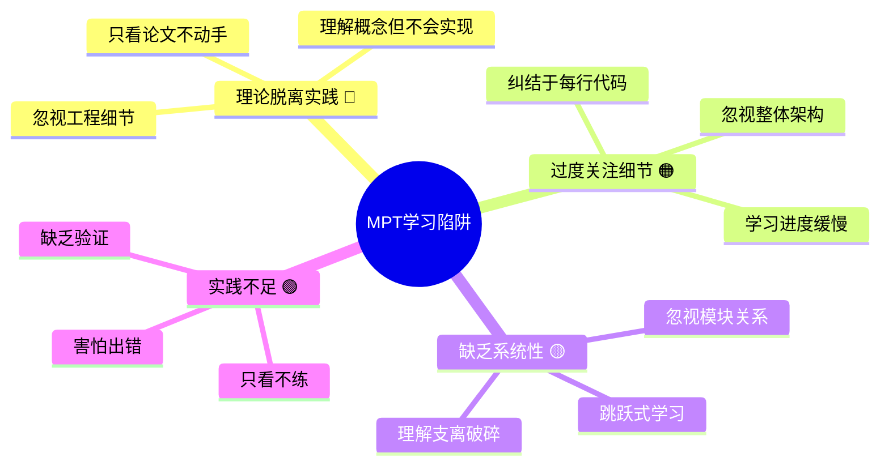

## 陷阱解决方案矩阵

| 陷阱类型 | 识别标志 | 解决策略 | 预防措施 | 评估方法 |
|---------|----------|----------|----------|----------|
| 理论脱离实践 | 能说不会做，代码运行困难 | 理论学习后立即编程实践 | 每个概念都要有对应代码 | 能否独立实现核心功能 |
| 过度关注细节 | 学习进度极慢，总是卡在小问题 | 按重要性分级，先掌握主干 | 设定明确时间限制 | 每日/周进度检查 |
| 缺乏系统性 | 理解零散，无法串联知识点 | 定期画架构图和知识图谱 | 保持全局视野 | 能否解释系统整体工作原理 |
| 实践不足 | 感觉都懂但一动手就出错 | 增加动手实践时间比例 | 理论:实践 = 3:7 | 实际项目完成度 |

## 学习困难应对策略

### 困难分类与解决路径
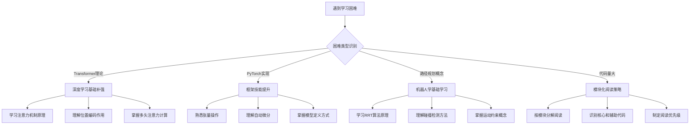

### 具体问题解决指南

#### 遇到复杂Transformer实现时的处理流程

**第一步：理解目标** 📋
- [ ] Transformer要解决什么路径规划问题？
- [ ] 输入是什么格式的地图数据？
- [ ] 输出是什么形式的路径信息？
- [ ] 在整个MPT系统中的作用是什么？

**第二步：查找资料** 📚
- [ ] 阅读Transformer原始论文
- [ ] 查找路径规划相关教程
- [ ] 寻找注意力机制的可视化演示
- [ ] 对比其他路径规划方法

**第三步：简化实现** 🛠️
- [ ] 实现最简单的注意力机制
- [ ] 逐步添加多头注意力
- [ ] 对比项目中的具体实现差异
- [ ] 理解每个组件的作用

**第四步：验证理解** ✅
- [ ] 能够向别人解释Transformer在路径规划中的工作原理
- [ ] 能够识别模型的关键超参数
- [ ] 能够处理不同尺寸的输入地图
- [ ] 能够调试模型训练过程

#### 数据处理学习优先级指南
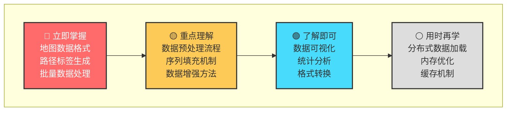

## 最终使用建议

### 学习成功的关键要素
1. **循序渐进**：按照学习路径逐步深入，不要跳跃
2. **理论实践结合**：每学一个概念都要有对应的代码实践
3. **系统性思维**：始终保持对整体架构的理解
4. **持续验证**：通过实际项目验证学习效果
5. **社区交流**：积极参与相关技术社区讨论

### 学习效果评估标准
- **能够独立运行和修改MPT代码**
- **理解Transformer在路径规划中的应用原理**
- **能够针对新环境调整模型参数**
- **具备扩展模型功能的能力**
- **能够解决训练过程中的常见问题**

通过遵循这个学习指南，你将能够系统性地掌握Motion Planning Transformers项目，不仅理解其技术原理，还能够在实际应用中灵活运用和扩展。记住，学习是一个渐进的过程，保持耐心和持续的实践是成功的关键。