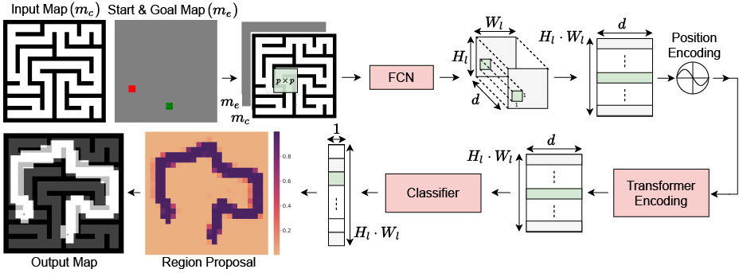

# Motion Planning Transformers: One Model to Plan them All
The network architecture for Motion Planning Transformers (MPT).



### Requirements
All our experiments were conducted on `Ubuntu18.04` with `Python3.6` with `CUDA11.0`. To generate the data, and evaluate the planner you will need the [OMPL-1.4.2](https://ompl.kavrakilab.org/index.html) library with the Python bindings.

Other python dependencies are given in `requirements.txt`. You can install the package using pip:

```bash
pip3 install -r requirments.txt
```

#### Using Docker

We highly recommend that to replicate our testing environment, users can use our docker container which contains all the necessary libraries packages. Please use the latest version of [nvidia-docker2](https://github.com/NVIDIA/nvidia-docker). Download the `.tar` [file](https://drive.google.com/file/d/154E338PduQPHfO0sUqA8ZST1GaQodY41/view?usp=sharing).

To load the image from the `tar` file, run the following:

```bash
docker load -i mpt_container.tar
```

To run the container, run the following command:

```bash
docker run -it --gpus all --shm-size="16G" -v ~/global_planner_data:/root/data -v <link-to-code-base>:/workspace bash
```

You can run the script in `docker/ompl_torch_docker.sh`. Attach the folder containing the data to `/root/data` and the folder with the code to `/workspace`.

### Creating Dataset
To generate training or validation data set for the point environment you can run the following command:

```bash
python3 rrt_star_map.py --start=... --numEnv=... --envType=... --numPaths=... --fileDir=... --mapFile

uv run rrt_star_map.py --start=0 --numEnv=100 --envType=forest --numPaths=25 --fileDir=data/forest

uv run rrt_star_map.py --start=0 --numEnv=1750 --envType=forest --numPaths=25 --fileDir=data/forest/train
```

To collect data samples for the car environment you can run the following command:

```bash
python3 sst_map.py --start=... --numEnv=... --numPaths=... --fileDir=...

uv run sst_map.py --start=... --numEnv=... --numPaths=... --fileDir=...

uv run se2_map_gpu.py --start=0 --numEnv=300 --numPaths=25 --fileDir=data/forest/train --workers=12
```

You can download all the data we used for training from [here](https://drive.google.com/drive/folders/1uP_l_pLLljRv6sn5xlcCkq3iTiuKHdDA?usp=sharing).

### Training

To train the data, run the following command:

```bash
python3 train.py --batchSize=... --mazeDir=... --forestDir=... --fileDir=...

uv run train.py --batchSize=32 --forestDir=data/forest --fileDir=data/point_robot

uv run train_uneven.py --batchSize=32 --env_list=desert --dataFolder=data/test_training --fileDir=data/uneven

uv run train_uneven.py --batchSize=32 --env_list=desert,map1,map3,map4 --dataFolder=data/test_training --fileDir=data/uneven --load_stage1_model=data/uneven/stage1_model_epoch_39.pkl

uv run train_uneven.py --batchSize=64 --dataFolder=data/terrain_dataset --fileDir=data/uneven --load_stage1_model=data/uneven/stage1_model_epoch_39.pkl

# 正常的两阶段训练
uv run train_uneven.py --batchSize 32 --env_list uneven --dataFolder /path/to/data --fileDir /path/to/save

# 加载第一阶段模型直接开始第二阶段训练
uv run train_uneven.py --batchSize 32 --env_list uneven --dataFolder /path/to/data --fileDir /path/to/save --load_stage1_model /path/to/stage1_model.pkl

```

### Pre-trained Models
You can download the pretrained models for the point robot and Dubins Car Model from [here](https://drive.google.com/file/d/1kVWNmjN1OAg5i5M3fzSbBQ0pSwpU8CU5/view?usp=sharing).

### Evaluation

To evaluate a set of validation paths, you can run the following code:

```bash
python3 eval_model.py --modelFolder=... --valDataFolder=... --start=... --numEnv=... --epoch=... --numPaths=...

uv run eval_model.py --modelFolder=data/point_robot --valDataFolder=data/forest/val --start=0 --numEnv=11 --epoch=5 --numPaths=25 --segmentType=mpt --plannerType=rrtstar
```


### Results

<table>
	<thead>
	<tr>
		<th>Environment </th>
		<th colspan="3">Random Forest</th>
		<th colspan="3">Maze</th>
	</tr>
	</thead>
	<tbody>
		<tr>
			<td></td>
			<td>Accuracy</td>
			<td>Time (sec)</td>
			<td>Vertices</td>
			<td>Accuracy</td>
			<td>Time (sec)</td>
			<td>Vertices</td>
		</tr>
		<tr>
			<td>RRT*</td>
			<td>100%</td>
			<td>5.44</td>
			<td>3227.5</td>
			<td>100%</td>
			<td>5.36</td>
			<td>2042</td>
		</tr>
		<tr>
			<td>IRRT*</td>
			<td>100%</td>
			<td>0.42</td>
			<td>267</td>
			<td>100%</td>
			<td>3.13</td>
			<td>1393.5</td>
		</tr>
		<tr>
			<td>UNet-RRT*</td>
			<td>30.27%</td>
			<td>0.13</td>
			<td>168</td>
			<td>21.4%</td>
			<td>0.31</td>
			<td>275.5</td>
		</tr>
		<tr>
			<td>MPNet</td>
				<td>92.35%</td>
				<td>0.29</td>
				<td>634</td>
				<td>71.76%</td>
				<td>1.72</td>
				<td>1408.5</td>
			</tr>
		<tr>
			<td>MPT-RRT*</td>
			<td>99.4%</td>
			<td>0.19</td>
			<td>233</td>
			<td>99.16%</td>
			<td>0.84</td>
			<td>626</td>
		</tr>
		<tr>
			<td>MPT-IRRT*</td>
			<td>99.4%</td>
			<td>0.08</td>
			<td>136</td>
			<td>99.16%</td>
			<td>0.73</td>
			<td>566</td>
		</tr>
		<tr>
			<td>MPT-RRT*-EE</td>
			<td>100%</td>
			<td>0.2</td>
			<td>247</td>
			<td>100%</td>
			<td>0.82</td>
			<td>585</td>
		</tr>
	</tbody>
</table>


### Visualizing Trajectories
To visualize trajectories, you can use the `VisualizeTrajectories.ipynb` notebook to view the paths. To spin up the jupyter notebook, you can run the following command inside the container environment.

```bash
export JUPYTER_TOKEN=mpt
jupyter notebook --allow-root --no-browser --ip=0.0.0.0. --port=8888
```

When prompted for a token enter `mpt`.

### Contributing

This code base is currently for reviewing purpose alone. Please do not distribute.
