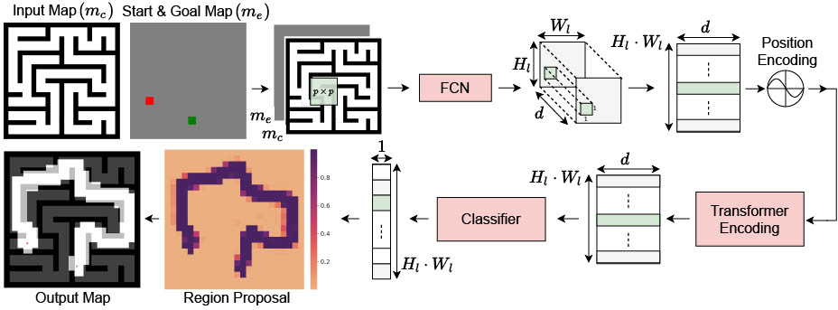

# Archived repository README

This snapshot retains superseded instructions for historical reference. Legacy
Python entry points now live under `legacy/mpt_baselines/` and should be run
with `python -m legacy.mpt_baselines.<module>` from the repository root.

# Boundary-Constrained Path MeanFlow

本仓库当前已经成立的主方法为：

**Boundary-Constrained Path MeanFlow**

中文名称：**基于一阶边界约束路径表示的条件 Path MeanFlow**。

当前主方法由以下模块组成：

1. Canonical geometric path parameterization；
2. First-order boundary-constrained B-spline representation；
3. First-order boundary-projected Gaussian path prior；
4. Conditional Path MeanFlow pretraining（Stage 1）。

当前部署形式为**单次路径生成**，部署主指标为 **Safe@1**。Oracle Safe@K
只用于覆盖和模式诊断；候选选择器不进入训练、推理或主结果表。

Stage 2 仍是待验证研究计划，不是当前已经成立的方法模块。其正式协议为：

[`docs/research/STAGE2_RESEARCH_PROTOCOL.md`](docs/research/STAGE2_RESEARCH_PROTOCOL.md)

模型输出的是供局部规划器跟随的二维全局几何参考路径。曲线参数 \(t\)
不表示真实时间，模型不生成速度、时长或控制输入。

术语规范详见
[docs/research/METHOD_NOMENCLATURE.md](docs/research/METHOD_NOMENCLATURE.md)。

## 训练

先进入环境：

```bash
cd /home/yrf/MPT
conda activate vim
```

当前正式训练只启动 Stage 1：

```bash
python3 train_flow.py \
  --workflow stage1 \
  --fileDir data/boundary_constrained_path_meanflow_v1 \
  --stage1_epochs 20
```

继续当前已保存的 Stage 1（旧目录名只作为资产路径保留）：

```bash
python3 train_flow.py \
  --workflow stage1 \
  --fileDir data/two_stage_meanflow_gauge44_v1 \
  --resume data/two_stage_meanflow_gauge44_v1/stage1_last.pth \
  --stage1_epochs 20
```

### 实验性 Stage 2 入口

以下命令仅保留用于受控实验，不代表当前正式 Method。不得在
`STAGE2_RESEARCH_PROTOCOL.md` 的前置准入未通过时直接启动多轮 Stage 2。

从最佳 Stage 1 启动实验性特权约束蒸馏：

```bash
python3 train_flow.py \
  --workflow stage2 \
  --fileDir data/boundary_constrained_path_meanflow_v1 \
  --prior_checkpoint data/boundary_constrained_path_meanflow_v1/stage1_best.pth \
  --stage2_rounds 20
```

继续实验性 Stage 2，例如训练到总计 30 个蒸馏轮：

```bash
python3 train_flow.py \
  --workflow stage2 \
  --fileDir data/boundary_constrained_path_meanflow_v1 \
  --resume data/boundary_constrained_path_meanflow_v1/stage2_last.pth \
  --stage2_rounds 30
```

注意：`stage1_epochs` 和 `stage2_rounds` 都表示最终总数，不是额外增加的数量。续训时 mask 相关参数必须与原训练保持一致。

tensorboard \
  --logdir data/boundary_constrained_path_meanflow_v1/tensorboard \
  --port 6006

http://localhost:6006

## 可视化

python3 vis_dit.py --environment env000039 --paths 0 1 2 3 4 5 --num_samples 32 --mask_mode stage1

```bash
python3 vis_dit.py \
  --checkpoint data/two_stage_meanflow_gauge44_v1/stage1_best.pth \
  --environment env000060 \
  --paths 0 3 6 9 12 15 \
  --num_samples 30 \
  --mask_seed 2025 \
  --mask_mode stage1
```

可分别使用 `--mask_mode full`、`stage1`、`stage2` 检查完整地图、
Stage 1 非阻断部分观测和 Stage 2 有界局部阻断。

```bash
python3 vis_dit.py \
  --checkpoint data/boundary_constrained_path_meanflow_v1/stage2_last.pth \
  --environment env000060 \
  --paths 0 3 6 9 12 15 \
  --num_samples 8 \
  --mask_seed 2027 \
  --mask_mode stage2
```

## 地图处理
先离线生成所有 train/val 的 stability map：

```bash
python3 -m tools.data.generate_stability_maps \
  --dataset-root data/dataset0 \
  --splits train val
```

# Motion Planning Transformers: One Model to Plan them All
The network architecture for Motion Planning Transformers (MPT).



### Requirements
All our experiments were conducted on `Ubuntu18.04` with `Python3.6` with `CUDA11.0`. To generate the data, and evaluate the planner you will need the [OMPL-1.4.2](https://ompl.kavrakilab.org/index.html) library with the Python bindings.

Other python dependencies are given in `requirements.txt`. You can install the package using pip:

```bash
pip3 install -r requirments.txt
```

#### Using Docker

We highly recommend that to replicate our testing environment, users can use our docker container which contains all the necessary libraries packages. Please use the latest version of [nvidia-docker2](https://github.com/NVIDIA/nvidia-docker). Download the `.tar` [file](https://drive.google.com/file/d/154E338PduQPHfO0sUqA8ZST1GaQodY41/view?usp=sharing).

To load the image from the `tar` file, run the following:

```bash
docker load -i mpt_container.tar
```

To run the container, run the following command:

```bash
docker run -it --gpus all --shm-size="16G" -v ~/global_planner_data:/root/data -v <link-to-code-base>:/workspace bash
```

You can run the archived script in `legacy/mpt_baselines/docker/ompl_torch_docker.sh`. Attach the folder containing the data to `/root/data` and the folder with the code to `/workspace`.

### Creating Dataset
To generate training or validation data set for the point environment you can run the following command:

```bash
python3 -m legacy.mpt_baselines.rrt_star_map --start=... --numEnv=... --envType=... --numPaths=... --fileDir=... --mapFile

uv run python -m legacy.mpt_baselines.rrt_star_map --start=0 --numEnv=100 --envType=forest --numPaths=25 --fileDir=data/forest

uv run python -m legacy.mpt_baselines.rrt_star_map --start=0 --numEnv=1750 --envType=forest --numPaths=25 --fileDir=data/forest/train
```

To collect data samples for the car environment you can run the following command:

```bash
python3 -m legacy.mpt_baselines.sst_map --start=... --numEnv=... --numPaths=... --fileDir=...

uv run python -m legacy.mpt_baselines.sst_map --start=... --numEnv=... --numPaths=... --fileDir=...

uv run python -m legacy.mpt_baselines.se2_map_gpu --start=0 --numEnv=300 --numPaths=25 --fileDir=data/forest/train --workers=12
```

You can download all the data we used for training from [here](https://drive.google.com/drive/folders/1uP_l_pLLljRv6sn5xlcCkq3iTiuKHdDA?usp=sharing).

### Training

To train the data, run the following command:

```bash
python3 -m legacy.mpt_baselines.train --batchSize=... --mazeDir=... --forestDir=... --fileDir=...

uv run python -m legacy.mpt_baselines.train --batchSize=32 --forestDir=data/forest --fileDir=data/point_robot

uv run train_uneven.py --batchSize=32 --env_list=desert --dataFolder=data/test_training --fileDir=data/uneven

uv run train_uneven.py --batchSize=32 --env_list=desert,map1,map3,map4 --dataFolder=data/test_training --fileDir=data/uneven --load_stage1_model=data/uneven/stage1_model_epoch_39.pkl

uv run train_uneven.py --batchSize=64 --dataFolder=data/terrain_dataset --fileDir=data/uneven --load_stage1_model=data/uneven/stage1_model_epoch_39.pkl
uv run train_uneven.py --batchSize=20 --dataFolder=data/terrain --fileDir=data/uneven --load_stage1_model=data/uneven/stage1_model_epoch_39.pkl

python3 train_mamba.py --batchSize=20 --dataFolder=data/sim_dataset --fileDir=data/sim --load_stage1_model=data/sim/best_stage1_model.pkl
python3 train_uneven.py --batchSize=20 --dataFolder=data/sim_dataset --fileDir=data/sim --load_stage1_model=data/sim/best_stage1_model.pkl
python3 train_uneven.py --batchSize=20 --dataFolder=data/sim_dataset --fileDir=data/sim --resume_stage1_model=data/sim/best_stage1_model.pkl
python3 train_mamba.py --batchSize=20 --dataFolder=data/sim_dataset --fileDir=data/sim --resume_stage1_model=data/sim/best_stage1_model.pkl

python3 train_cdit.py --batchSize=20 --dataFolder=data/sim_dataset --fileDir=data/sim
python3 train_grpo.py --batchSize=20 --dataFolder=data/sim_dataset --fileDir=data/sim --resume data/sim/stage1_best_model.pth --stage 2
python3 train_fisher.py --batchSize=20 --dataFolder=data/sim_dataset --fileDir=data/sim --resume data/sim/stage1_best_model.pth --stage 2

python3 train_fisher.py --batchSize=20 --fileDir=data/sim
python3 train_fisher.py --batchSize=20 --fileDir=data/sim --resume data/sim/stage1_best_model.pth
python3 train_fisher.py --batchSize=20 --fileDir=data/sim --resume data/sim/stage1_best_model.pth --stage 2
python3 train_fisher.py --batchSize=20 --fileDir=data/sim --resume data/sim/stage2_best_model.pth --stage2_anchor data/sim/stage1_best_model.pth --stage 2

python3 train_fisher.py --batchSize=20 --dataFolder=data/sim_dataset --fileDir=data/sim --resume data/sim/stage2_best_model.pth --stage2_anchor data/sim/stage1_best_model.pth --stage 2

python3 train_fisher.py --batchSize=20 --dataFolder=data/sim_dataset --fileDir=data/sim --resume data/sim/stage1_best_model.pth --stage 2 --fisher_mode none

python3 train_fisher.py --batchSize=20 --dataFolder=data/sim_dataset --fileDir=data/sim --resume data/sim/stage2_best_model.pth --stage2_anchor data/sim/stage1_best_model.pth --stage 2 --fisher_mode none

python3 train_langevin.py --batchSize=2 --dataFolder=data/sim_dataset --fileDir=data/sim --resume data/sim/stage1_best_model.pth --stage 2

python3 train_dit.py --batchSize=20 --dataFolder=data/sim_dataset --fileDir=data/sim
python3 train_dit.py --batchSize=20 --dataFolder=data/sim_dataset --fileDir=data/sim --resume data/sim/stage1_best_model.pth --stage 2
python3 train_dit.py --batchSize=20 --dataFolder=data/sim_dataset --fileDir=data/sim --resume data/sim/stage1_best_model.pth
python3 train_dit.py --batchSize=20 --dataFolder=data/sim_dataset --fileDir=data/sim --resume data/sim/stage2_best_model.pth --stage 2

python3 train_dit.py --batchSize=20 --dataFolder=data/sim_dataset --fileDir=data/sim --resume data/sim/stage1_best_model.pth --stage 2 --use_lora 1 --lora_rank 8

tensorboard --logdir=data/sim/

# 使用LoRA进行第二阶段微调（rank=8）
python train_dit.py --batchSize 32 --stage 2 --use_lora 1 --lora_rank 8

# 传统全参数训练（向后兼容）
python train_dit.py --batchSize 32 --stage 2 --use_lora 0

python3 train_polynomial_dit.py --batchSize=20 --dataFolder=data/sim_dataset --fileDir=data/polynomial

python3 train_bspline_dit.py --batchSize=20 --dataFolder=data/sim_dataset --fileDir=data/bspline

uv run train_mamba.py --batchSize=20 --dataFolder=data/terrain_dataset --fileDir=data/mamba

# 正常的两阶段训练
uv run train_uneven.py --batchSize 32 --env_list uneven --dataFolder /path/to/data --fileDir /path/to/save

# 加载第一阶段模型直接开始第二阶段训练
uv run train_uneven.py --batchSize 32 --env_list uneven --dataFolder /path/to/data --fileDir /path/to/save --load_stage1_model /path/to/stage1_model.pkl

```

### Pre-trained Models
You can download the pretrained models for the point robot and Dubins Car Model from [here](https://drive.google.com/file/d/1kVWNmjN1OAg5i5M3fzSbBQ0pSwpU8CU5/view?usp=sharing).

### Evaluation

To evaluate a set of validation paths, you can run the following code:

```bash
python3 -m legacy.mpt_baselines.eval_model --modelFolder=... --valDataFolder=... --start=... --numEnv=... --epoch=... --numPaths=...

uv run python -m legacy.mpt_baselines.eval_model --modelFolder=data/point_robot --valDataFolder=data/forest/val --start=0 --numEnv=11 --epoch=5 --numPaths=25 --segmentType=mpt --plannerType=rrtstar
```


### Results

<table>
	<thead>
	<tr>
		<th>Environment </th>
		<th colspan="3">Random Forest</th>
		<th colspan="3">Maze</th>
	</tr>
	</thead>
	<tbody>
		<tr>
			<td></td>
			<td>Accuracy</td>
			<td>Time (sec)</td>
			<td>Vertices</td>
			<td>Accuracy</td>
			<td>Time (sec)</td>
			<td>Vertices</td>
		</tr>
		<tr>
			<td>RRT*</td>
			<td>100%</td>
			<td>5.44</td>
			<td>3227.5</td>
			<td>100%</td>
			<td>5.36</td>
			<td>2042</td>
		</tr>
		<tr>
			<td>IRRT*</td>
			<td>100%</td>
			<td>0.42</td>
			<td>267</td>
			<td>100%</td>
			<td>3.13</td>
			<td>1393.5</td>
		</tr>
		<tr>
			<td>UNet-RRT*</td>
			<td>30.27%</td>
			<td>0.13</td>
			<td>168</td>
			<td>21.4%</td>
			<td>0.31</td>
			<td>275.5</td>
		</tr>
		<tr>
			<td>MPNet</td>
				<td>92.35%</td>
				<td>0.29</td>
				<td>634</td>
				<td>71.76%</td>
				<td>1.72</td>
				<td>1408.5</td>
			</tr>
		<tr>
			<td>MPT-RRT*</td>
			<td>99.4%</td>
			<td>0.19</td>
			<td>233</td>
			<td>99.16%</td>
			<td>0.84</td>
			<td>626</td>
		</tr>
		<tr>
			<td>MPT-IRRT*</td>
			<td>99.4%</td>
			<td>0.08</td>
			<td>136</td>
			<td>99.16%</td>
			<td>0.73</td>
			<td>566</td>
		</tr>
		<tr>
			<td>MPT-RRT*-EE</td>
			<td>100%</td>
			<td>0.2</td>
			<td>247</td>
			<td>100%</td>
			<td>0.82</td>
			<td>585</td>
		</tr>
	</tbody>
</table>


### Visualizing Trajectories
To visualize trajectories, use `legacy/mpt_baselines/notebooks/VisualizeTrajectories.ipynb`.

```bash
export JUPYTER_TOKEN=mpt
jupyter notebook --allow-root --no-browser --ip=0.0.0.0. --port=8888
```

When prompted for a token enter `mpt`.

### Contributing

This code base is currently for reviewing purpose alone. Please do not distribute.
